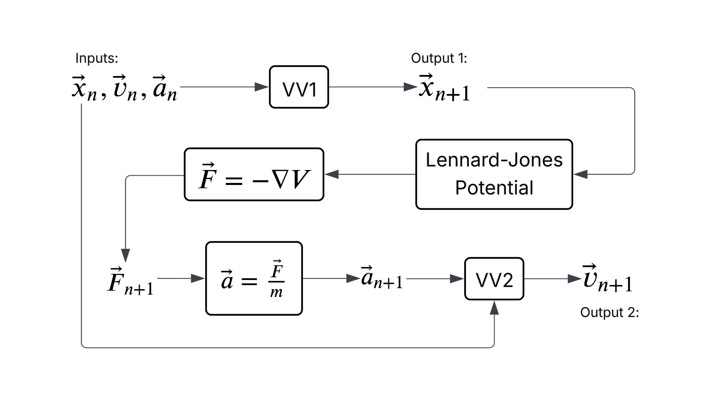
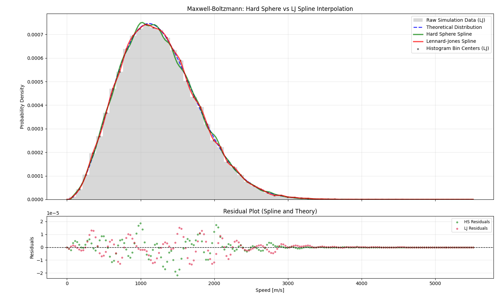
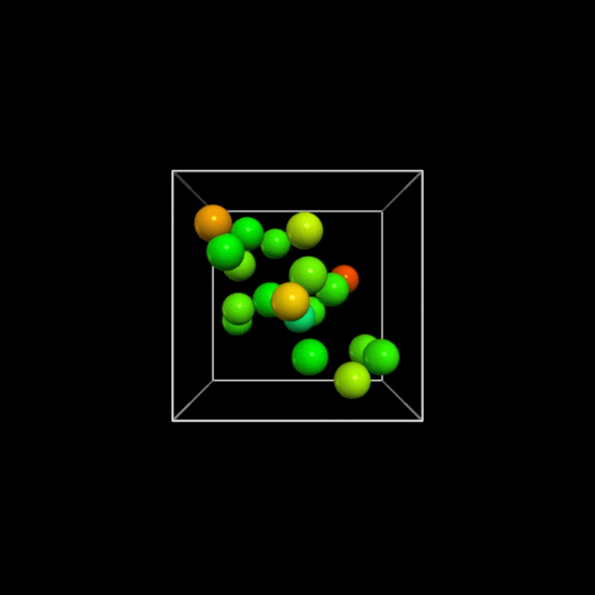
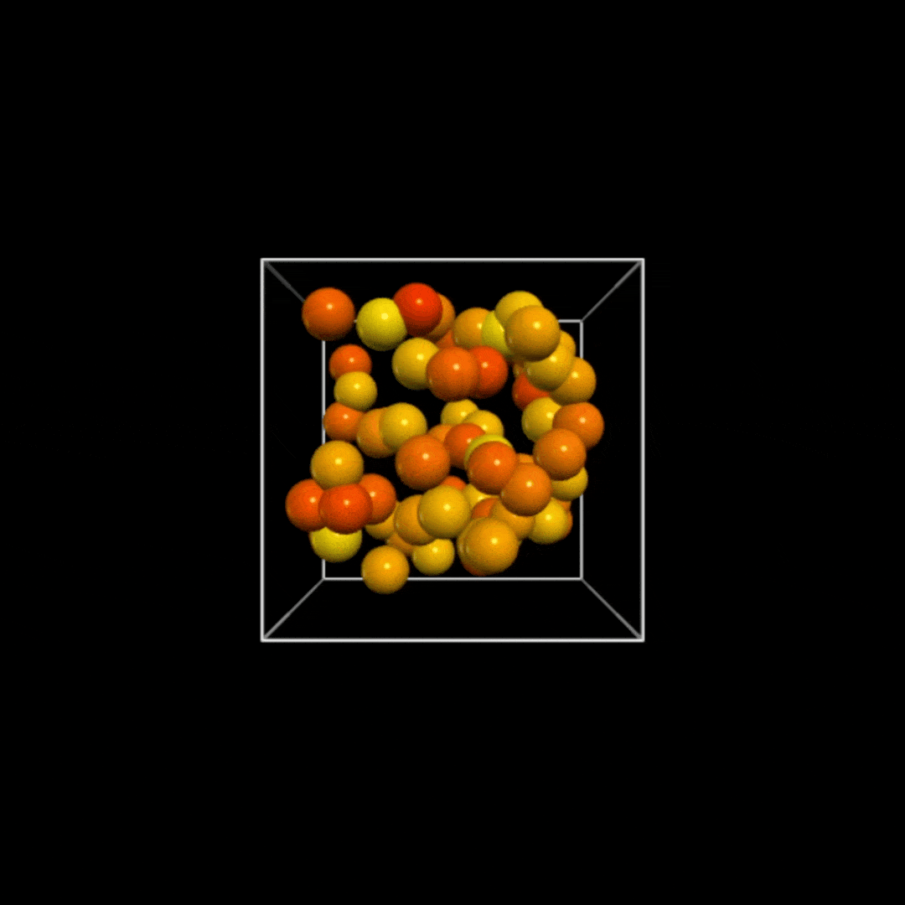
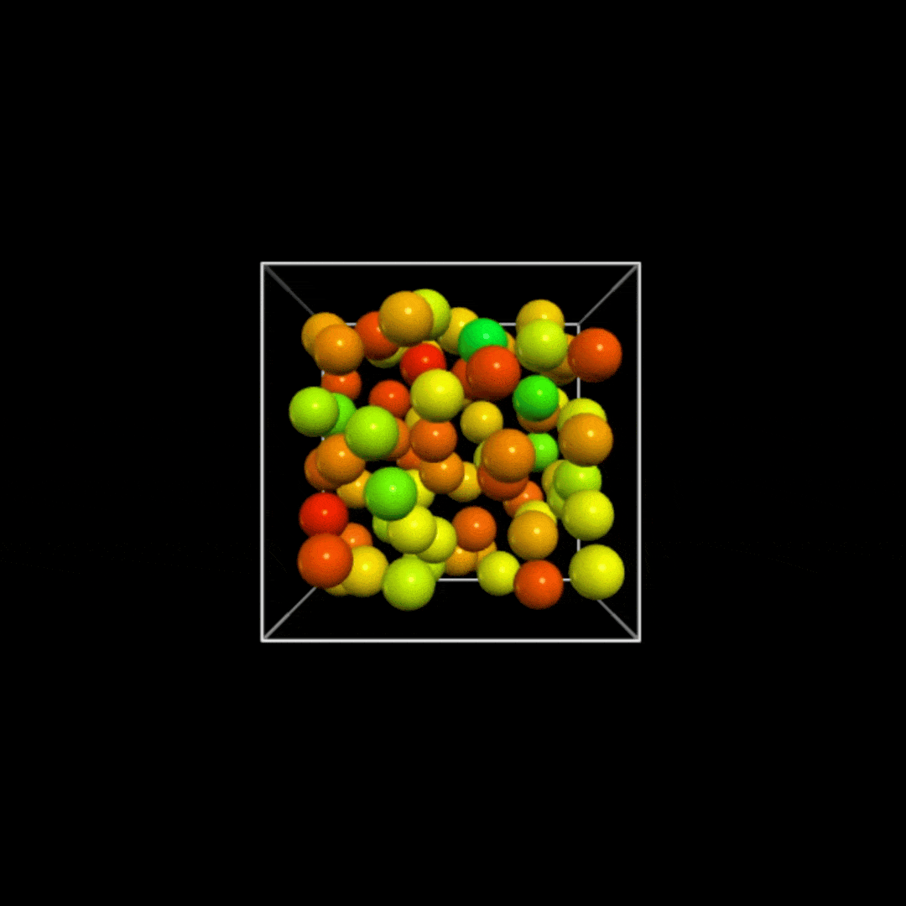
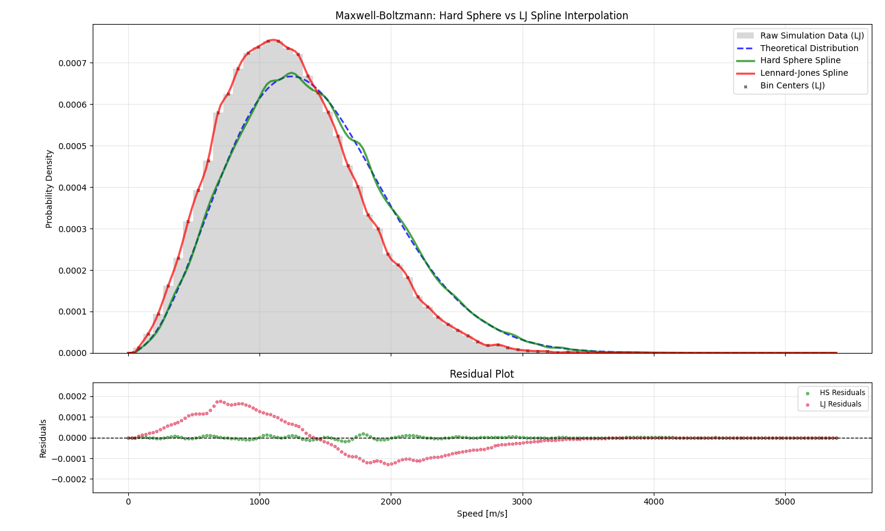
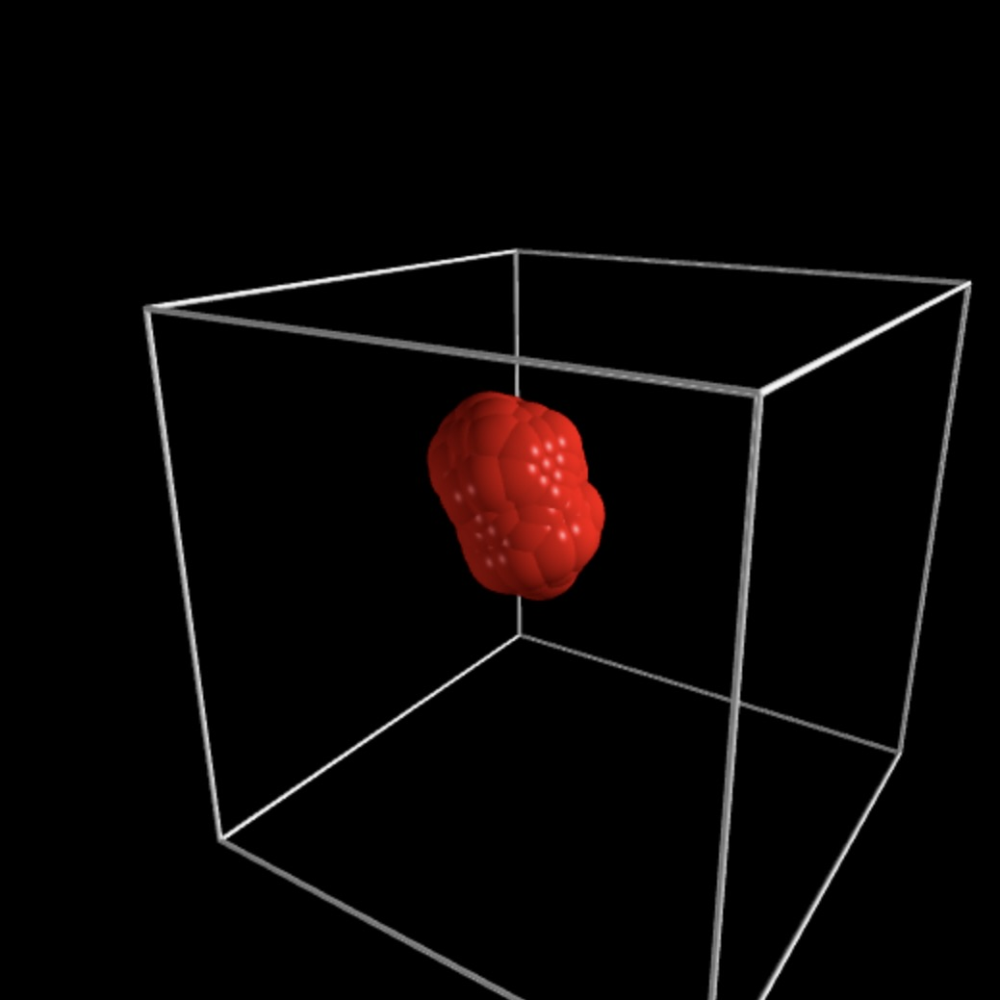

# Comparison of Lennard-Jones Potential and Hard-Sphere Models: Equilibrium Velocity Distributions and Thermal Properties
The project extends my previous work, [Numerical Reconstruction of the Maxwell-Boltzmann Distribution via a 3D Monatomic Hard-Sphere Simulation](https://github.com/youMetTem/NumericalMBPDFreconSimulation), by replacing the hard-sphere interaction with Lennard-Jones potential and utilize the Velocity Verlet Algorithm. Both model of hard-sphere and Lennard-Jones potential are compared by evaluating how well each reproduce the theoretical Maxwell-Boltzmann velocity distribution.

Furthermore, to highlight the strengths and limitations of each motion model, this project also explores their thermal response to rapid temperature reduction (quenching). By visualizing 3D particle dynamics simulation and observe how each model react as the temperature decreases.

<table>
  <tr>
    <td width="60%" align="center" valign="middle">
      
    </td>
    <td width="40%" align="center" valign="middle">
      
    </td>
  </tr>
</table>

## Table of Contents
1. [Project Overview](#comparison-of-lennard-jones-potential-and-hard-sphere-models-equilibrium-velocity-distributions-and-thermal-properties)
2. [Theoretical Background](#theoretical-background)
3. [Methodology](#methodology)
4. [Results](#results)
5. [Conclusion](#conclusion)
6. [Installation & Usage](#installation--usage)
7. [Acknowledgements & Resources](#acknowledgements--resources)
8. [AI Use Declaration](#ai-use-declaration)

## Theoretical Background
### The Maxwell-Boltzmann Distribution
To statistically validate that a molecular dynamic simulation is accurate, the distribution of particle speeds from the simulation is compared against the theoretical *Maxwell-Boltzmann Distribution*. For an ideal gas at thermodynamic equilibrium, the speeds of particles are not uniform. Instead, they follow a specific probability distribution known as **Maxwell-Boltzmann PDF**.

The probability density function $f(v)$ for a particle of mass $m$ at temperature $T$ is given by:

$$
f(v)=4\pi \left( \frac{m}{2\pi k_B T} \right)^{3/2} v^2 \exp\left(-\frac{mv^2}{2k_B T}\right)
$$

### The Hard-Sphere Model
The Hard-Sphere model describes a system of particles that interact only through perfect collisions. As demonstrated in my [previous work](https://github.com/youMetTem/NumericalMBPDFreconSimulation). The interaction potential $V(r)$ is discontinous:

$$
V_{Hard-Sphere}(r) =
\begin{cases}
\infty, & r < 2R \\
0, & r \ge 2R
\end{cases}
$$

Where $2R$ is the diameter of the particle and $r$ is the distance between particle centers. Due to the discontinuity in interaction potential, particles simulated from this model will move with constant velocity in straight lines between collisions.

This model only accounts for repulsive forces, lacking the intermolecular attractive component which could be observed in real-world particles. Consequently, it cannot simulate nano cluster or droplet formation upon decreases in temperature.


### The Lennard-Jones Potential
In order to simulate realistic thermal properties and phase behavior, including the formation of nano cluster and droplets, this project utilize the Lennard-Jones (LJ) Potential. The LJ model introduces soft, continous interaction that accounts for both repulsion and attraction.

$$
V_{LJ}(r) = 4\epsilon \left[ \left( \frac{\sigma}{r} \right)^{12} - \left( \frac{\sigma}{r} \right)^6 \right]
$$

This potential is characterized by two terms:
1. Repulsion ($(\sigma/r)^{12}$): Modeling the Pauli exclusion principle.
2. Attraction ($(\sigma/r)^{6}$): Modeling long-range Van der Waals interaction.

With Modeling of Van der Waals interaction included in this project, it allow particles to bind together when their kinetic energy drops below the potential energy barrier. The enables 3D simulation of particle clustering and phases transitions.

Furthermore, this study aims to compare the the accuracy of speeds distribution data obtain from both *Hard-Sphere* and *Lennard-Jones Potential* model. By reconstruct the speeds distribution of both model with *Cubic Spline interpolation* and compare them with the the Maxwell-Boltzmann theoretical distribution.


## Methodology
This project consists of 2 phases the Kinematic Simulation, which generate raw physical data from *Hard-Sphere* and *Lennard-Jones potential* model, and the comparative numerical reconstruction, which analyzes the statistical properties and implement Cubic Spline Interpolation to both model and compare their accuracy. Additionally, 3D dynamic visualization of LJ model, Hard-Sphere model response to rapid temperature decreases and LJ model simulation without external interference is also provided.

Both simulation models system of particles colliding within a bouned 3D cubic container of length $L$. The simulation is initialized with $N$ Spherical particles, each having mass $m$ and radius $R$ at $T$ Temperature in Kelvin. ($L, N, m, T,$ and particle element can be modified in the `main.py` and other update files)

### Simulation Conditions for Lennard-Jones Potential Model

#### Initialization Condition (Lennard-Jones Potential Model)
1. Positions ($\vec{r}$): Initialized uniformly apart from each other within the domain $(R, L-R)$ for all dimension $(x, y, z)$. Ensuring no two particles overlapping when spawned.
2. Velocities ($\vec{v}$): Initialized with random components in $(x, y, z)$ but root mean square ($v_{rms}$) of all particles are scaled to theoretical value. Directly correlate Temperature ($T$) with the simulation's environment (As the system stabilized this set Temperature will decreases slightly)
3. Discrete Time Steps ($dt$): Set as 0.2 factor of the time interval particle takes to move with displacement equals to its radius. Preventing unexpected particle tunnelling from excessive initial $dt$.

#### Kinetic Simulation (Lennard-Jones Potential Model)
As the Lennard-Jones Potential model incorporates attractive and repulsive forces, depending on distance between every particle, each particle would exhibit non-constant acceleration over time. [Previous project's](https://github.com/youMetTem/NumericalMBPDFreconSimulation/tree/main?tab=readme-ov-file#kinematics-simulation) quadrature method of Euler forward integration will not be appropriate for this, so I utilize the **Velocity Verlet Algorithm** which offers greater energy stability instead.

The **Velocity Verlet Algorithm** consists of two recursive equation ($VV1, VV2$):

$$
\vec{r}_{n+1} = \vec{r}_{n} + \vec{v}_{n}dt + \frac{1}{2} \vec{a}_{n}dt^2
$$

$$
\vec{v}_{n+1} = \vec{v}_{n} + \frac{1}{2} (\vec{a}_{n} + \vec{a}_{n+1})dt
$$

Iterating between 2 aforemention Velocity Verlet Algorithm following provided diagram below, position and velocity at any time $t>t_{0}$ will be solved.


<div align = "center">
<table>
  <tr>
    <td align="center">
      
    </td>
  </tr>
</table>
</div>


From the diagram solving for $\vec{F}\_{n+1}$ from $\vec{r}\_{n+1}$ is achievable by calculating the gradient of Lennard-Jones Potential Function:

* Given the potential:

$$
V(r) = 4\epsilon \left[ \left(\frac{\sigma}{r}\right)^{12} - \left(\frac{\sigma}{r}\right)^6 \right]
$$

$$
\vec{F} = -\nabla V = - \left( \frac{\partial V}{\partial x}\hat{i} + \frac{\partial V}{\partial y}\hat{j} + \frac{\partial V}{\partial z}\hat{k} \right)
$$

* Calculate the x-component $\vec{F}_x$ with chain rule. Define the scalar distance $r = \sqrt{x^2 + y^2 + z^2}$:

$$
\begin{aligned}
\vec{F}_x &= - \frac{\partial V(r)}{\partial x}\hat{i} = - \left( \frac{dV(r)}{dr} \cdot \frac{\partial r}{\partial x} \right)\hat{i}
\end{aligned}
$$

$$
\frac{\partial r}{\partial x} = \frac{\partial}{\partial x}\sqrt{x^2+y^2+z^2} = \frac{x}{\sqrt{x^2+y^2+z^2}} = \frac{x}{r}
$$

$$
\vec{F}_x = - \left( \frac{dV(r)}{dr} \cdot \frac{x}{r} \right)\hat{i}
$$

* Repeat this for all three dimension:

$$
\begin{aligned}
\vec{F} &= \vec{F}_x + \vec{F}_y + \vec{F}_z = - \frac{dV}{dr} \left( \frac{x}{r}\hat{i} + \frac{y}{r}\hat{j} + \frac{z}{r}\hat{k} \right) = - \frac{dV}{dr} \left( \frac{\vec{r}}{r} \right)
\end{aligned}
$$

* Where $\frac{\vec{r}}{r}$ being the unit vector representing the direction of the collision. Then, Calculate the scalar derivative $\frac{dV}{dr}$ from the potential function:

$$
\begin{aligned}
\frac{dV}{dr} = \frac{d}{dr} \left( 4\epsilon \left[ \left(\frac{\sigma}{r}\right)^{12} - \left(\frac{\sigma}{r}\right)^6 \right] \right) = 4\epsilon \left[ 12\sigma^{12}(-r^{-13}) - 6\sigma^6(-r^{-7}) \right] = -\frac{24\epsilon}{r} \left[ 2\left(\frac{\sigma}{r}\right)^{12} - \left(\frac{\sigma}{r}\right)^6 \right]
\end{aligned}
$$

* Substitute back into the force vector equation:

$$
\vec{F} = - \left( -\frac{24\epsilon}{r} \left[ 2\left(\frac{\sigma}{r}\right)^{12} - \left(\frac{\sigma}{r}\right)^6 \right] \right) \frac{\vec{r}}{r}
$$

$$
\vec{F} = \frac{24\epsilon}{r^2} \left[ 2\left(\frac{\sigma}{r}\right)^{12} - \left(\frac{\sigma}{r}\right)^6 \right] \vec{r}
$$

By combining this result with Velocity Verlet recursive funcion, any $\vec{r}(t), \vec{v}(t), \vec{a}(t)$ will be solveable.


### Simulation Conditions for Hard-Sphere Model

#### Physical Assumptions (Hard-Sphere Model)
I treat the system as an Ideal Gas. The require specific constraints on how particles behave:
1. **No Intermolecular Forces**: Particles do not attract or repel each other at a distance. They only interact when they physically collide (*Hard-Sphere Model*).
2. **Random Motion**: Particles move in straight lines in random directions until they collide with each other or the container wall.
3. **Elastic Collisions**: All collisions are perfectly elastic, no energy is lost to heat or deformation.
4. **Small Atomic Radius**: Particles posses very small atomic radius (matching the real size of an Element in nanometers).

Note: As the simulation needs to check for particle colliding, I can not assume of *Point Mass*.

#### Initialization Condition (Hard-Sphere Model)
1. Positions ($\vec{r}$): Initialized uniformly apart from each other within the domain $(R, L-R)$ for all dimension $(x, y, z)$. Ensuring no two particles overlapping when spawned.
2. Velocities ($\vec{v}$): Initialized with random components in $(x, y, z)$ but root mean square ($v_{rms}$) of all particles are scaled to theoretical value. Directly correlate Temperature ($T$) with the simulation's environment (Assuming constant total kinetic energy).
3. Discrete Time Steps ($dt$): Set as 0.2 factor of the time interval particle takes to move with displacement equals to its radius. Preventing unexpected particle tunnelling from excessive initial $dt$.

#### Kinematic Simulation and Collision Handling Mechanism (Hard-Sphere Model)
* The simulation evolves over discrete time steps $dt$. With each step $dt$, particle position are updated using Forward Euler integration:
 
$$
\vec{r}(t+dt) = \vec{r}(t) + \vec{v}(t)dt
$$

* Wall-Particle Collisions: Container walls are treated as infinite mass barriers with perfect elasticity. If particle conponent $r_{i}$ reaches or exceeds the boundary limits $L$, the velocity components perpendicular to the wall will be inverted:

$$
\vec{v}_{\perp, new} = -\vec{v}_{\perp, old}
$$

* Particle-Particle Collisions: At every step of evolving $dt$, the scripts checks for overlapping particle pairs. By finding Euclidean distance between each particles pair $i$, $j$ and check if they are below particle's diameter:

$$
\lVert \vec{r}_{i}-\vec{r}_{j} \rVert \le 2R
$$

* Once the collision event is triggered, the velocity are updated based on the conservation of linear momentum and kinetic energy. For two particles of equal mass, the post-collision velocities are calculated using vector projection along the line of impact. 

$$
\vec{v}_{1, f} = \vec{v}_{1, i} - \frac{(\vec{v}_{1, i}-\vec{v}_{2, i}) \cdot (\vec{r}_{1, i}-\vec{r}_{2, i})}{\lVert \vec{r}_{1, i}-\vec{r}_{2, i} \rVert^2} (\vec{r}_{1, i}-\vec{r}_{2, i})
$$
$$
\vec{v}_{2, f} = \vec{v}_{2, i} - \frac{(\vec{v}_{2, i}-\vec{v}_{1, i}) \cdot (\vec{r}_{2, i}-\vec{r}_{1, i})}{\lVert \vec{r}_{2, i}-\vec{r}_{1, i} \rVert^2} (\vec{r}_{2, i}-\vec{r}_{1, i})
$$

For detailed derivation refer to my previous project in the [Particle-Particle Collisions](https://github.com/youMetTem/NumericalMBPDFreconSimulation/tree/main?tab=readme-ov-file#particle-particle-collisions) Section


### Data Structure & Vectorization
The system states are represented using **Numpy** $N$-dimension arrays. All mathematical operations are represented as vectorized linear algebra operation as well.
1. **Position Matrix ($\mathbf{R}$)**: An $(N \times 3)$ array where the $i$-th row represents the coordinates of particle $i$.

$$
\mathbf{R}_{N \times 3} = 
\begin{bmatrix} 
\vdots & \vdots & \vdots \\
r_{i,x} & r_{i,y} & r_{i,z} \\
\vdots & \vdots & \vdots 
\end{bmatrix} 
$$

$$
\vec{r}_{i} = r_{i, x} \hat{i} + r_{i, y} \hat{j} + r_{i, z} \hat{k}
$$

2. **Velocity Matrix ($\mathbf{V}$)**: An $(N \times 3)$ array where the $i$-th row represents the velocity of particle $i$.

$$
\mathbf{V}_{N \times 3} = 
\begin{bmatrix} 
\vdots & \vdots & \vdots \\
v_{i,x} & v_{i,y} & v_{i,z} \\
\vdots & \vdots & \vdots 
\end{bmatrix} 
$$

$$
\vec{v}_{i} = v_{i, x} \hat{i} + v_{i, y} \hat{j} + v_{i, z} \hat{k}
$$

3. **Pairwise Displacement Tensor (LJ only) ($\Delta \mathbf{R}$)**: An $(N \times N \times 3)$ tensor is constructed to compute all pairwise displacement vectors simultaneously.

$$
\Delta \mathbf{R} =
\begin{bmatrix}
\vec{0} & \vec{r}_{1} - \vec{r}_{2} & \cdots & \vec{r}_{1} - \vec{r}_{N} \\
\vec{r}_{2} - \vec{r}_{1} & \vec{0} & \cdots & \vec{r}_{2} - \vec{r}_{N} \\
\vdots & \vdots & \ddots & \vdots \\
\vec{r}_{N} - \vec{r}_{1} & \vec{r}_{N} - \vec{r}_{2} & \cdots & \vec{0}
\end{bmatrix}=
\begin{bmatrix}
\begin{pmatrix} 0 \\ 0 \\ 0 \end{pmatrix} & \begin{pmatrix} x_{12} \\ y_{12} \\ z_{12} \end{pmatrix} & \cdots & \begin{pmatrix} x_{1N} \\ y_{1N} \\ z_{1N} \end{pmatrix} \\
\begin{pmatrix} x_{21} \\ y_{21} \\ z_{21} \end{pmatrix} & \begin{pmatrix} 0 \\ 0 \\ 0 \end{pmatrix} & \cdots & \begin{pmatrix} x_{2N} \\ y_{2N} \\ z_{2N} \end{pmatrix} \\
\vdots & \vdots & \ddots & \vdots \\
\begin{pmatrix} x_{N1} \\ y_{N1} \\ z_{N1} \end{pmatrix} & \begin{pmatrix} x_{N2} \\ y_{N2} \\ z_{N2} \end{pmatrix} & \cdots & \begin{pmatrix} 0 \\ 0 \\ 0 \end{pmatrix}
\end{bmatrix}
$$

4. **Pairwise Force Interaction Tensor (LJ only) ($\mathbf{F}$)**: An $(N \times N \times 3)$ tensor is constructed to compute all pairwise displacement vectors simulataneously.

$$
\mathbf{F}_{pair} =
\begin{bmatrix}
\vec{0} & f(r_{12}) \cdot \vec{r}_{12} & \cdots & f(r_{1N}) \cdot \vec{r}_{1N} \\
f(r_{21}) \cdot \vec{r}_{21} & \vec{0} & \cdots & f(r_{2N}) \cdot \vec{r}_{2N} \\
\vdots & \vdots & \ddots & \vdots \\
f(r_{N1}) \cdot \vec{r}_{N1} & f(r_{N2}) \cdot \vec{r}_{N2} & \cdots & \vec{0}
\end{bmatrix}
$$


### Comparative Numerical Reconstruction
With the Lennard-Jones Potential model is simulated in the Microcanonical Ensemble (NVE), the conversion of potential energy into kinetic energy which happens as the system stabilize causes the system's temperature to drift from its initial value $T_{initial}$

#### Comparison Setup
To ensure valid comparison at the same Temperature $T$ equilibirum thermal energy level, the following steps are done:
1. **LJ Simulation Stabilization**: The Lennard-Jones Potential system is initialized with initial velocities matching the initial Temperture $T_{initial}$ and allowed to relax as the simulation is operated.
2. **Stabilized Temperature Extraction**: The final Stabilized Temperature ($T_{stable}$) is calculated from the new $v_{rms}$ of the LJ model system.
3. **Hard-Sphere model synchromization**: The Hard-Sphere simulation is then initialized using this exact new $T_{stable}$.
4. **Theoretical Curve**: The Maxwell-boltzmann theoretical curve is recalculated using $T_{stable}$ to prevent systemetic temperature drift.

#### Data Sampling
To reconstruct PDF, the simulation of both model are run for 700 steps of iteration until the system reaches it equilibrium and all transients are eliminated, then data are collected for 50 samples for every 50 simulation iteration apart. Later, all data are stacked and combined into single large array, velocity magnitudes are then extracted and binned into histogram. Cubic Spline Interpolation and Error analysis are then applied to these data sets.

#### Cubic Spline Interpolation
To reconstruct the PDF without assuming the underlying physical relation with gaussian distribution or any type of regressions, I utilize Cubic Spline interpolation. Using the histogram bin midpoints as data set of $(x_i, y_i)$, the algorithm constructs a piecewise function $S_{i}(x)$ for each interval $[x_{i}, x_{i+1}]$:

$$
S_{i}(x) = a_i + b_i (x-x_i) + c_i (x-x_i)^2 + d_i (x-x_i)^3
$$

$$
S(x) = 
\begin{cases} 
S_i(x) & x \in [x_i, x_{i+1}] \\
S_{i+1}(x) & x \in [x_{i+1}, x_{i+2}] \\
S_{i+2}(x) & x \in [x_{i+2}, x_{x+3}] \\
\vdots & \vdots \\
S_{n-1}(x) & x \in [x_{n-1}, x_n]
\end{cases}
$$


The coefficients ($a_i, b_i, c_i, d_i$) are determined by applying countinuity constraints for the function, its first and second derivative at every datapoints.

Additionally, due to a known limitation of polynomial interpolation method, including cubic spline, is **Unbounded Extrapolation**. While the spline accurately models the distribution within the sampled velocity range $[v_{min}, v_{max}]$, the polynomials inherently diverge towards $\pm \infty$ outside this domain. To counter against this issue, I resolve it by setting any prediction data outside the range of $[v_{min}, v_{max}]$ to 0 and remove any negative result probability.

#### Error Analysis
The quantitative divergence of each simulation from the theoretical Maxwell-Boltzmann PDF ($f_{MB}$) is calculated using the Mean Squared Error (MSE):

$$
MSE = \frac{1}{M} \sum_{k=1}^{M} \left( S(v_k) - f_{MB}(v_k) \right)^2
$$

Where $v_k$ represents the evaluation points along the velocity domain. This metric allow me to objectively determine which potential model better captures the thermodynamic behavior of the gas.


### Visualization and Output
#### Statistical and Visualization Output
Data is aggregated into a composite visualization generated via **Matplotlib**. The output is divided into 2 coupled subplots sharing a common velcoity axis.
1. Probability Density Comparison (Top Panel):
   * **Theoretical Benchmark**: Maxwell-Boltzmann distribution for the stabilized temperature $T_{stable}$ is plotted as a dashed blue line, serving as the theoretical reference.
   * **Simulated Models**: The cubic spline interpolations for both model datasets are overlaid on the same axes.
2. Residual Analysis (Bottom Panel):
   To visualize the deviations of each model from the theoretical curve, a residual plot is generated below the main distribution. The residual $R(v)$ is calculated as:

$$
R_{Hard-Sphere}(v) = PDF_{Hard-Sphere}(v) - PDF_{theoretical}(v)
$$

$$
R_{LJ}(v) = PDF_{LJ}(v) - PDF_{theoretical}(v)
$$

3. Quantitative Report: the scripts also calculates the **Mean Square Error** (MSE) for both models against the theoretical curve. These values are reported directly to the standard output terminal to provide a quick numerical summary of the simulation's accuracy.

#### 3D Dynamic Visualization Output
In addition to statistical analysis, this project also utilize `VPython` to render a real-time 3D animated visualization of the particle dynamics. This environment is used to conduct three distinct simulations to observe particles behavior.
1. **Equilibrium Simulation**: In the standard setup, the Lennard-Jones potential system is simulated in a Microcanonical ensemble without external interference
2. **Lennard-Jones Potential Model Reaction to Rapid Quenching**: to observe LJ's model particles behavior upon rapid temperature drops, the simulation introduces a time-dependent cooling mechanism.

   At every time step, the velocity vectors of all particles are scaled by a damping factor $\lambda < 1$, draining kinetic energy from the system over time:

$$
v_{new} = v_{old} \times \lambda (t)
$$

3. Hard-Sphere Model Reaction to Rapid Quenching: The same cooling mechanism from `2.` is applied to be observed and compare

The simulations simulate Argon atoms instead of the default Helium in the statistical analysis. Due to its higher melting point, nano clustering, phase changes and droplet forming is better illustrated.


## Results
### Statistical Accuracy
As illustrated as in the following figure, both the Hard-Sphere and Lennard-Jones potential models successfully converged to the Maxwell-Boltzmann Distribution at stable temperature ($T_{stable}$). However, the Lennard-Jones potential model exhibited slightly higher degree of accuracy as shown in the output MSE value. Both model depict negligibly low error margin observed across numerous sampling iteration. Provided several numerical key metrics:
* **Max Residual Error**:
  * Lennard-Jones Potential Model: $< 2.5 \times 10^{5}$
  * Hard-Sphere Model: $< 2.5 \times 10^{5}$
* **Mean Square Error (MSE)**: 
  * Lennard-Jones Potential Model: $2.21 \times 10^{-11}$
  * Hard-Sphere Model: $2.74 \times 10^{-11}$
* Notable detail worth mentioning:
  * Cubic Spline Residuals exhibiting tiny cone shape sinuiodal oscillation: This is most likely cause by approximating a transcendental function of exponential decay with piecewise polynomial, utlizing inappropriate interpolation method, regression model is the cause of this problem. 

<div align = "center">
<table>
  <tr>
    <td align="center">
      
    </td>
  </tr>
</table>
</div>

### Visual Analysis

#### Lennard-Jones Potential Equilibrium Simulation without external interference:

It is evident that particle trajectories exhibited clear deviations from linearity even when not in direct contact. As particles passed near one another, their paths curved slightly toward each other. This confirms the presence of the attractive Van der Waals interaction, a feature completely absent in the Hard-Sphere simulation model.

<div align = "center">
<table>
  <tr>
    <td align="center" valign="middle">
      
      <br>
      <a href="https://youtube.com/shorts/vWlpTpxOJlw?feature=share">Better Quality Video</a>
    </td>
  </tr>
</table>
</div>


#### Model Reaction to Rapid Quenching:

* Lennard-Jones Potential Model
The system responded to quenching by clumping together. As kinetic energy decreased, particles trapped in the potential wells of their neightbors could not escape, leading to the spontaneous formation of clumps and clusters. While clustering was observed, the final structure did not resemble a perfect crystalline lattice. Instead, particles formed disordered aggregates. I interpret it as an direct consequence of the rapid quenching rate. The system was cooled too quickly for particle to explore the energy landscape and find the global minimum, resulting in an amourphous solid structure, which mirrors real-world physical vapor deposition in rapid quenching.

* Hard-Sphere Model
Hard-Sphere system exhibited a simple freezing behavior. Particle slowed down and evetually stopped in their final ballistic linear position. No spatial rearrangement occured. This confirms that without an attractive potential, no cohesion or phase separation is possible regardless of temperature.

<table>
  <tr>
    <td width="50%" align="center" valign="middle">
      Rapid Quenching Lennard-Jones Potential Model
      
      <a href="https://youtube.com/shorts/Ec__Y7lUqe8?feature=share">Better Quality Video</a>
    </td>
    <td width="50%" align="center" valign="middle">
      Rapid Quenching Hard-Sphere Model
      
      <a href="https://youtube.com/shorts/hVQZPgusziA?feature=share">Better Quality Video</a>
    </td>
  </tr>
</table>

### Challenges and Limitations
#### Thermodynamic Drift in NVM Ensemble (Solved)
The Lennard-Jones system consistenly equilibrated at a temperature lower than the initial setpoint ($T_{stable} < T_{initial}$), invalidating direct comparisons with the Hard-Sphere model and the theoretical Maxwell-Boltzmann Distribution. The system is initialized in a non-equilibrium. As particle reach equilibrium, part of the kinetic energy is converted into potential energy to conserve the Hamiltonian, naturally droping the temperature.

Instead of artificial thermostatting, the methodology was adapted to a post-stabilization synchronization approach. The LJ system is allowed to stabilize and the fianl $T_{stable}$ is then measured and used to re-initialize the Hard-Sphere control group and the theoretical reference.

#### Particle Trapped Upon Slow Temperature Decreases (Remain an issue)
The cooling method used global velocity scaling ($v_{new} = \lambda \times v_{old}$). If scalling occurs while particles are in the steep repulsive region, they loose the kinetic energy necessary to rebound and separate.

This create a kinetic trap where particles are frozen in high-energy overlapping state, unable to rearrange into a crystal structure even if the temperature dropping is not rapid. This confirm that valid crystallization require other method of temperature decreases, which I do plan to further study and fix this issue.

<table>
  <tr>
    <td width="65%" align="center" valign="middle">
      Thermodynamic Drift (Before Resolved)
      
    </td>
    <td width="35%" align="center" valign="middle">
      Particle Trapped (Remain an Issue)
      
    </td>
  </tr>
</table>


## Conclusion
This project compared Hard-Sphere and Lennard-Jones Potential models for simulating particle dynamic by numerical method. While both reproduced the Maxwell-Boltzmann distribution, statistical analysis showed the Lennard-Jones Potential model was more accurate due to its continous attractive and repulsive forces, which enable smoother and more realistic thermalization.

In 3D simulations, rapid cooling revealed a key difference: Hard-Sphere particles simply stopped, whereas Lennard-Jones Potential particles formed clusters, demonstrating that attractive forces are essential for modeling phase changes like droplet formation. Although fast cooling led to disordered clumps rather than crystals, this highlights opportunities for improved temperature control in future work. Overall, the Lennard-Jones Potential model better captures complex thermodynamic behavior.


## Installation & Usage
### 1. Prerequisites & Setup
First, ensure you have Python 3.x installed. For window OS replace `python3` with `python`.

Clone repository:
```bash
git clone https://github.com/youMetTem/LJvsHardSphereSimulationModel.git
cd LJvsHardSphereSimulationModel
```

Install requirements:
```bash
python3 -m venv env
. env/bin/activate
pip install -r requirements.txt
```

### 2. Running Simulation and Comparative Analysis (`main.py`)
By default, the simulation models 70 Argon molecules at initial temperature of 1073 K confined within a cubic box of side length $2.2 \times 10^{-9}$ m. There parameters can be modified in the `main.py`, `updateHardSphere.py`, `updateLJ.py` files.

Run the script:
```bash
python3 src/main.py
```

This will run the simulation with Lennard-Jones potential model with initial kinetic energy corresponding to 373 K for 700 iterations. After equilibration, 50 samples are collected every 50 iteration to compute a new equilibrium temperature. The simulation is then rerun at this temperature using the Hard-Sphere model. Distribution and residual plots compare both models to the theoretical curve, and the MSE for each model will be reported in the matplotlib window and terminal, respectively.

### 3. Running the 3D Simulation Visualizations
This project provides 3 simulation visualization models:
#### Visualization of the Lennard–Jones potential model without external interference.

```bash
python3 src/visLJ3DconstTemp.py
```

#### Visualization of the hard-sphere model’s response to rapid temperature decreases.

```bash
python3 src/visTempChangeHardSphere3D.py
```

#### Visualization of the Lennard–Jones model’s response to rapid temperature decreases.

```bash
python3 src/visTempChangeLJ3D.py
```
A local web server will start, and your default web browser will automatically open a new tab to display the 3D animation.


#### 3D Simulation Controls (MacOS/Trackpad)
Once the browser window opens, you can navigate the 3D space using these trackpad gestures:

| Action | Trackpad Gesture | Keyboard Alternative |
| :--- | :--- | :--- |
| **Rotate View** | **Two-finger Click** & Drag | Hold **Ctrl** + Click & Drag |
| **Zoom In/Out** | **Two-finger Swipe** (Up/Down) | Hold **Option (Alt)** + Click & Drag |
| **Pan (Move)** | Hold **Shift** + Click & Drag | -- |

Note: For more details on camera control, refer to the official [VPython Documentation](https://www.glowscript.org/docs/VPythonDocs/index.html#).


## Acknowledgements & Resources
This project was inspired by several excellent resources. Special thanks to the following creators, authors for their high quality educational content:
* **Physics for Scientists and Engineers (Serway & Jewett)** - Primary reference for the Kinetic Theory of Gases and Maxwell-Boltzmann derivation.
* **[Molecular interaction and the Lennard-Jones potential](https://youtu.be/Yqj5jHUE3wI?si=RdwNpKF5yMZtr6Yk)** by *Prof. John Holman* - Explanation on the working principle of "Lennard-Jones potential".
* **[Velocity Verlet Algorithm - Solving equations of motion | Molecular Dynamics](https://www.youtube.com/watch?v=qT8pxV53FA4&t=500s)** by *LearnWithVinay* - Providing theoretical flowchart of the *Velocity Verlet Algorithm*
* **[Numerical Methods for Engineers](https://youtube.com/playlist?list=PLkZjai-2Jcxn35XnijUtqqEg0Wi5Sn8ab&si=NUFmcl7sFmRZM9Wr)** by *Prof. Jeffrey Chasnov* - Provided the concept of numerical matrix operation and cubic spline interpolation.
* **[EGME206 Numerical Methods for Engineers, Spring 2021](https://youtube.com/playlist?list=PLLM1AZpDbYI1HPhHWmA-_5YqF26Rnt9ZM&si=xaMQ15EgJC063XTu)** by *Prof. Ittichote Chuckpaiwong* - In-dept explanation in the topic of Regressions.
* **[VPython for Beginners](https://youtube.com/playlist?list=PLdCdV2GBGyXOnMaPS1BgO7IOU_00ApuMo&si=8MC25WVnnu3wRcem)** by *Let's Code Physics* - Introduce the usage of `VPython` for 3D simulation.


## AI Use Declaration
This project utilized AI tools to assits in the development process and text refinement.
* **GitHub Copilot:** Used for code autocompletion, debugging scripts, and snipped generation.
* **Google Gemini:** Used for mundane snipped code generation, drafting the initial structure of this README file, text refinement, and documentation formatting.

All scientific logics, mathematical derivations, and final code implementation were verified and reviewed by me.
